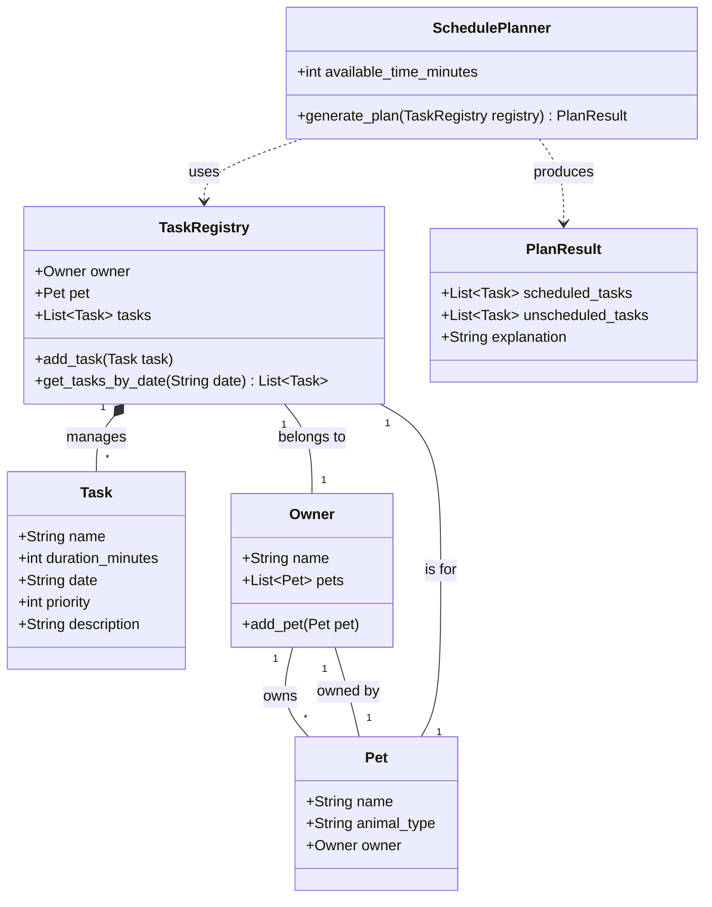

# PawPal+ UML Architecture

```mermaid
classDiagram
    class Owner {
        +String name
        +List~Pet~ pets
        +add_pet(Pet pet)
    }

    class Pet {
        +String name
        +String animal_type
        +Owner owner
    }

    class TaskRegistry {
        +Owner owner
        +Pet pet
        +List~Task~ tasks
        +add_task(Task task)
        +get_tasks_by_date(String date) List~Task~
    }

    class Task {
        +String name
        +int duration_minutes
        +String date
        +int priority
        +String description
    }

    %% Suggested Additions for Scheduling Logic
    class SchedulePlanner {
        +int available_time_minutes
        +generate_plan(TaskRegistry registry) PlanResult
    }

    class PlanResult {
        +List~Task~ scheduled_tasks
        +List~Task~ unscheduled_tasks
        +String explanation
    }

    Owner "1" -- "*" Pet : owns
    Pet "1" -- "1" Owner : owned by
    TaskRegistry "1" *-- "*" Task : manages
    TaskRegistry "1" -- "1" Owner : belongs to
    TaskRegistry "1" -- "1" Pet : is for
    SchedulePlanner ..> TaskRegistry : uses
    SchedulePlanner ..> PlanResult : produces
```
