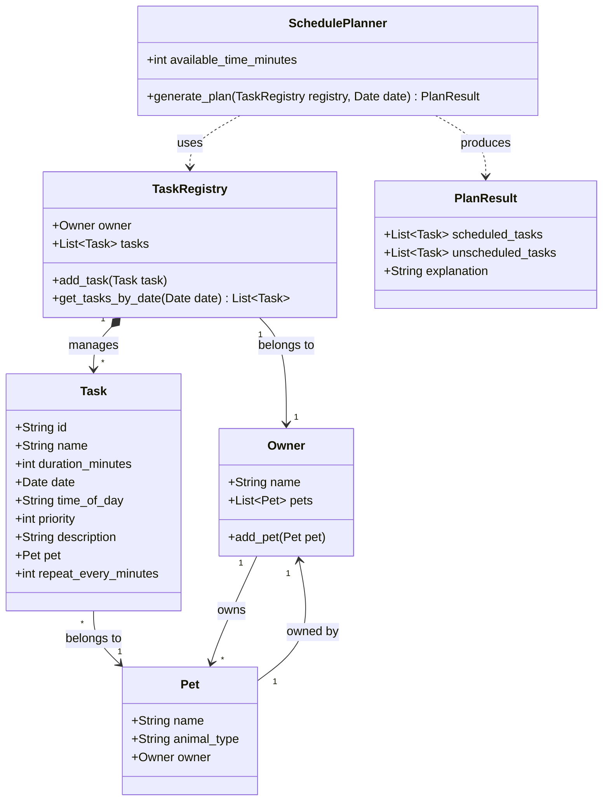

# PawPal+ UML Architecture

```mermaid
classDiagram
    class Owner {
        +String name
        +List~Pet~ pets
        +add_pet(Pet pet)
    }

    class Pet {
        +String name
        +String animal_type
        +Owner owner
    }

    class TaskRegistry {
        +Owner owner
        +List~Task~ tasks
        +add_task(Task task)
        +get_tasks_by_date(Date date) List~Task~
    }

    class Task {
        +String id
        +String name
        +int duration_minutes
        +Date date
        +String time_of_day
        +int priority
        +String description
        +Pet pet
        +int repeat_every_minutes
    }

    %% Suggested Additions for Scheduling Logic
    class SchedulePlanner {
        +int available_time_minutes
        +generate_plan(TaskRegistry registry, Date date) PlanResult
    }

    class PlanResult {
        +List~Task~ scheduled_tasks
        +List~Task~ unscheduled_tasks
        +String explanation
    }

    Owner "1" --> "*" Pet : owns
    Pet "1" --> "1" Owner : owned by
    TaskRegistry "1" *--> "*" Task : manages
    TaskRegistry "1" --> "1" Owner : belongs to
    Task "*" --> "1" Pet : belongs to
    SchedulePlanner ..> TaskRegistry : uses
    SchedulePlanner ..> PlanResult : produces
```
